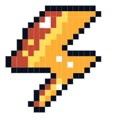
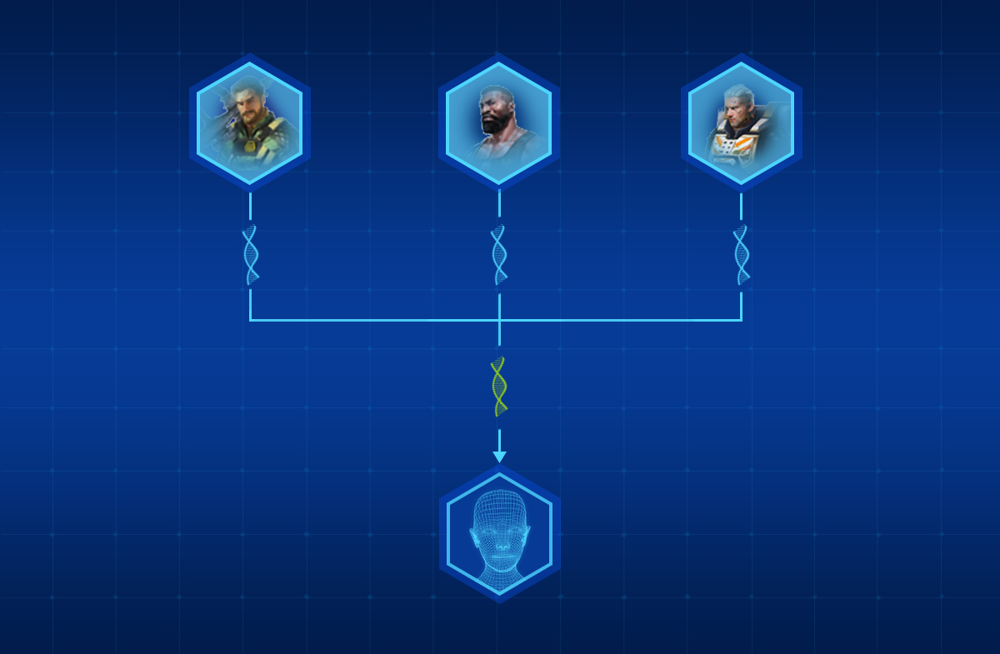

#   AOD Character
#### There are 3 ways to collect heroes: via rescue hero, buy in shop and auction in the marketplace.
Heroes are another important NFT asset in the product. It not only has powerful combat power and cool appearance, but also has unique skills, which can play a huge role in combat, defense, production, construction and other fields. 

Players can buy NFT heroes, and then synthesize new heroes by fusing gene fragments. Each hero has skin color, hair color, hairstyle, body, eye color and other appearance characteristics. Players extract gene fragments from the purchased heroes, and then fuse them in the biological laboratory to obtain new heroes. The new hero will inherit the appearance characteristics of the parent hero, so in theory, a variety of heroes with different appearances will be combined to ensure the diversity of NFT heroes in appearance.

Players can cultivate this hero according to their own ideas, customize the learning plan of various skills, and create a personalized, brand-new hero that belongs to you.
Hero skills include:
* Increase the destructive power of combat troops
* Improve the survivability of combat troops
* Improve the mobility of combat troops
* Increase the yield of gathering buildings
* Improve the research and development speed and training speed of functional buildings
* Improve the defense of the base
* Healing combat troops
Each hero can learn a variety of skills, and the diverse skill combinations ensure the uniqueness and personalization of hero functions and their value as NFT assets.

