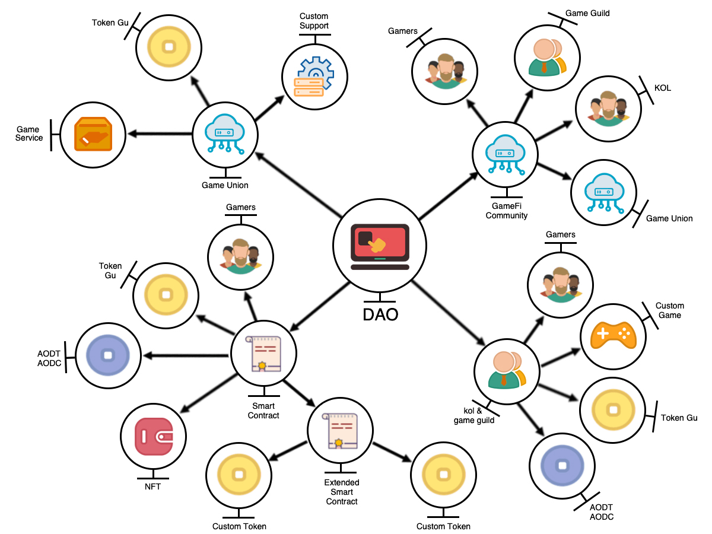

# 🕍 DAO In AOD

However, how to integrate the basic concept of DAO into the GameFi community governance, how to realize DAO from the technical and contract level, and let the game guild and game players experience the essence of DAO, has always been a problem.

We’re seeing these same patterns in DAO play out in Web3.

GameUnion uses DAO’s ideas to build a community. We will work with game guilds, opinion leaders, gamers, etc. to maintain the smooth operation and healthy development of the community.

The token GU will run through all the games developed by our community and be used for community governance, the operation of the game's core economic model, and game player rewards.。

Game guilds and opinion leaders can use their own tokens, build their own game servers, and gather their own community members to join GameFi activities. This is exactly the idea of DAO - fully decentralized, everyone can be the center.

We will share the token GU with guilds, opinion leaders, and gamers. Each game guild can have its own independent game, which is the basic realization of the DAO idea. We want to achieve two goals, the long-term vision of the token GU and the short-term incentives of the game guild's own token.

By practicing the concept of DAO, we can build a community in which game guilds, gamers, and opinion leaders can build the GameFi ecosystem together and build a harmonious metaverse community together.
