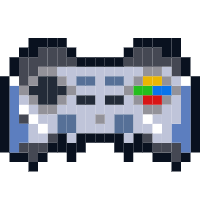
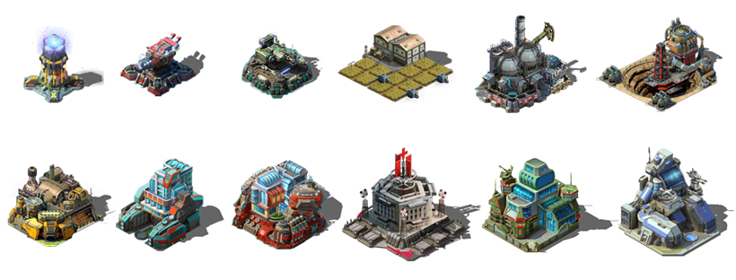
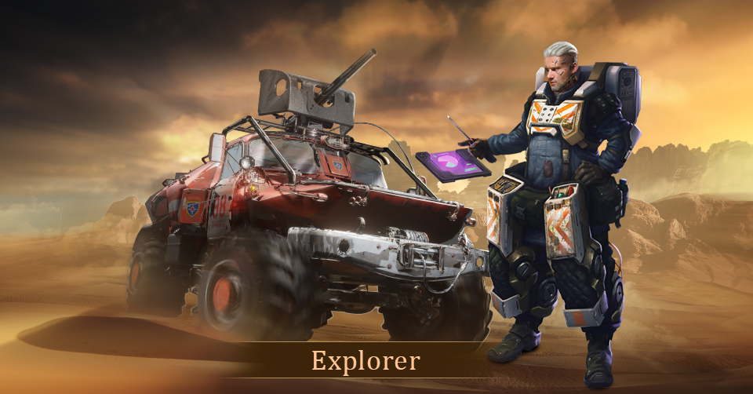
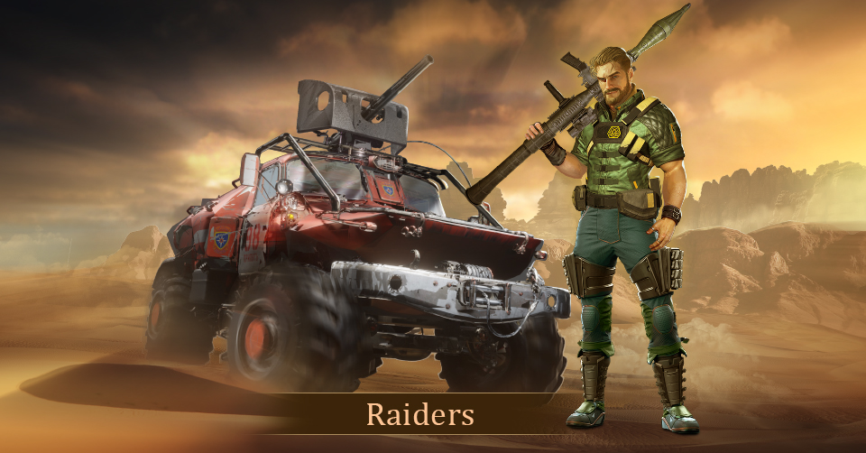

#  GamePlay
#### 1. First, you need to enter the game by purchasing NFT land, and operate your base on the land.
#### 2. The product is positioned as an SLG game.
Players collect resources, train troops, upgrade technology, and cultivate heroes by operating bases. And send troops to clean up the surrounding zombies, occupy various resource points, in order to obtain more wealth and resources. Then compete against other players in alliance battles for glory.
#### 3. Players can build three types of buildings: function, collection, and defense.
* Functional buildings: can provide functions such as researching technology, training soldiers, and cultivating heroes.
* Gathering buildings: Obtain all kinds of resources necessary for production, construction and cultivation.
* Defense: Provide defense for the base area, making it more difficult for the enemy to break through.
 

#### 4. Heroes exist as powerful combat units and personalizations of the game. 
Players can train heroes according to their own preferences, obtain various skill points and talent points for them, and create their own heroes according to their own strategic deployment.

#### 5. Combat units: Players can train four types of combat units: Defender, Rogue, Shooter, and Destroyer. 
Each combat unit has its own characteristics and combat positioning. There is a mutual growth and mutual restraint relationship between the four combat units. Players can use their strategies flexibly and reasonably match arms to make themselves victorious in every battle.
#### 6. There are four resources in the game plan: stone, wood, food, and oil. 
Players will have specific needs for these resources in the construction, production, research, training, medical and other modules. Therefore, when collecting resources, it is necessary to evenly distribute the collection power as much as possible, and there must be no shortcomings and emphasis, otherwise it will not be conducive to the subsequent operation and development, which is also a test of the player's wealth management ability.

#### 7. Field system: There are various biochemical monsters wandering around the base area, and there are also strongholds with rich mineral resources. 
Players get rewards by sending troops to clean up those biochemical monsters, and they can also send troops to occupy those mines and continue to gain wealth. Note that the number of troops to be dispatched is limited, and it takes time to send troops, so please allocate your combat troops reasonably.
#### 8. Alliance war, players can form an alliance or join an alliance to strengthen their strength and find more partners. 
Alliance members can exchange resources, learn from each other, and prosper together. Of course, other alliances may not be relatively friendly. Due to the scarcity of high-level resources, conflicts between alliances will be inevitable. As a member, you must do your best for the growth of your alliance, that is, do your best for yourself. A strong alliance will be indispensable to you. rely on.