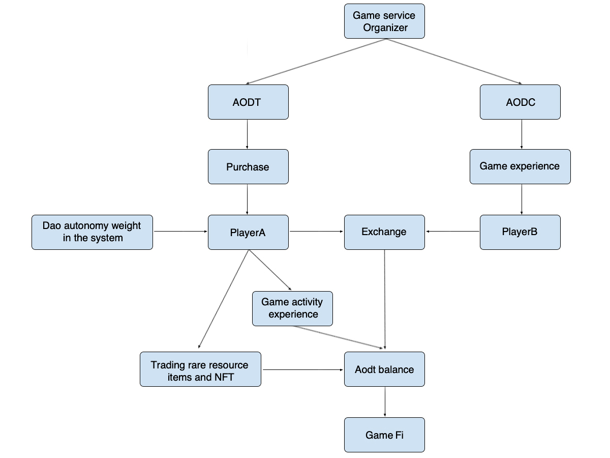

#  Treasury
----------
Game governance token: AODT is the governance token of Alliance of Doomsday game products and the carrier of players' behavior through GameFi during game time. AODT is the value measurement of the game's internal ecology. At the same time, after a player holds a certain amount of AODT, they can initiate and participate in voting on game affairs in the game. The system will determine the voting weight of each player based on the number of AODT held by the player. As a strong value measure, AODT can be used as a general equivalent logistics, which can be used to purchase scarce resources in the game, and can also be used as a currency for players to build interactive resources. According to the game system settings, AODT can be obtained by ranking rewards, team war reparations, etc. 

Game token: AODC is the game token of Alliance of Doomsday game products. As the incentive token of the game, it can be used as the base currency for transactions between players, and can also be used to interact with the system in the game to obtain game system resources, such as purchasing Materials and services can be used to upgrade heroes, buildings, etc., and can also be used to purchase various props in the game. Players can obtain AODC through mission rewards, PVE drops, PVP battle looting, game treasure chest drops, leaderboard rewards, etc. 

Trade unions or player leaders can customize privatized game services as game experience organizers. In privatized game services, organizers can apply to issue AODT & AODC by themselves. Gameunion will support it after review. The organizer will issue private AODT & AODC and The game service will make the game experience more personalized, more adaptable to the preferences of different player groups for the game experience, and can adapt to more token distribution platforms. The acquisition method and amount of AODT & AODC in the actual game can be determined by the users of the privatized game service platform through community autonomous voting.