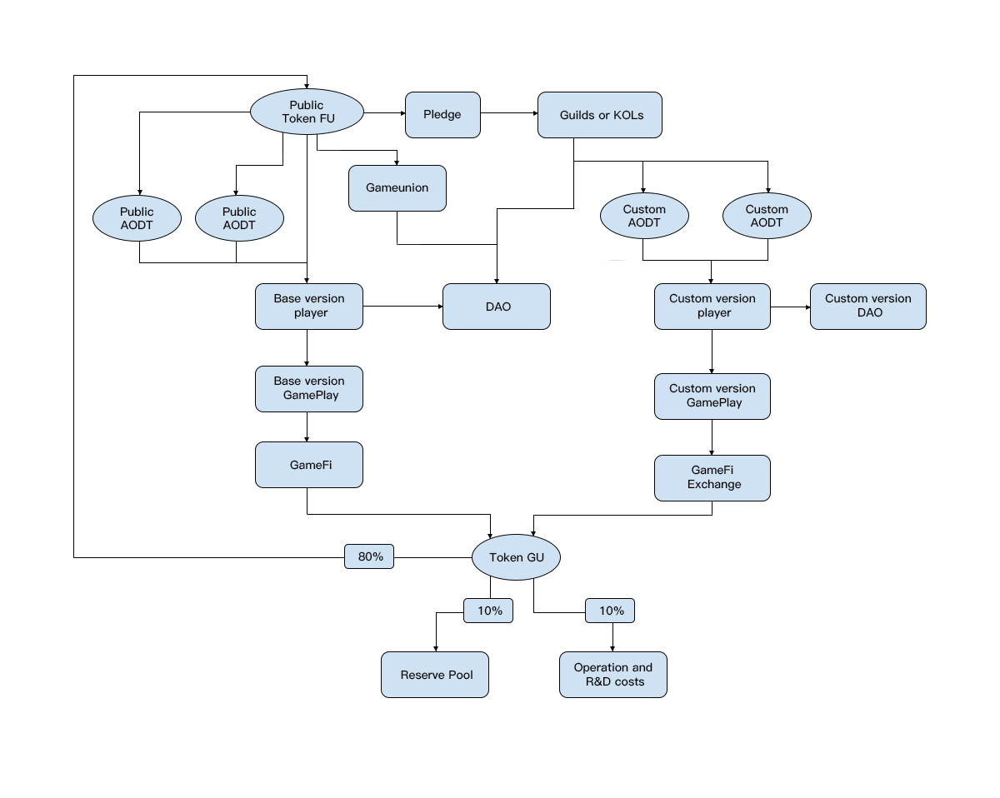

# 🪐 GU Economic

Token GU is the platform governance token of the GU ecosystem, which can be used to demarcate the value of all game core assets on the entire platform. Token GU can be used for the initial purchase and transaction of core assets of different games.

Token GU is also used for the community autonomy of the entire GameUnion ecological DAO. Users who hold Token GU can participate in community autonomy in GameUnion DAO and express their opinions on the GU ecosystem. The system will determine the weight of user voting according to the number of Token GUs, and users will influence the development direction of the GU ecosystem by initiating voting and participating in voting.

Relying on the value of TokenGU, AODT is the product governance token of the AOD game project in the Gameunion ecosystem. There are standard AODTs and custom AODTs customized in the private game system, among which the customized AODT can be used for customized issuance by game associations or game player opinion leaders, officially supported, and has the function of community governance token in the community autonomy of the private game system DAO , which can be traded on different blockchains to realize GameFi that supports different blockchains.

AODC relies on the player's game experience value and is the game currency of the products of AOD game projects. There are standard AODTs and custom AODTs customized in private game systems, which players earn and accumulate through game behavior. It can be used by players to purchase common resources in the game in the game store, or can be traded between players as a base currency.

