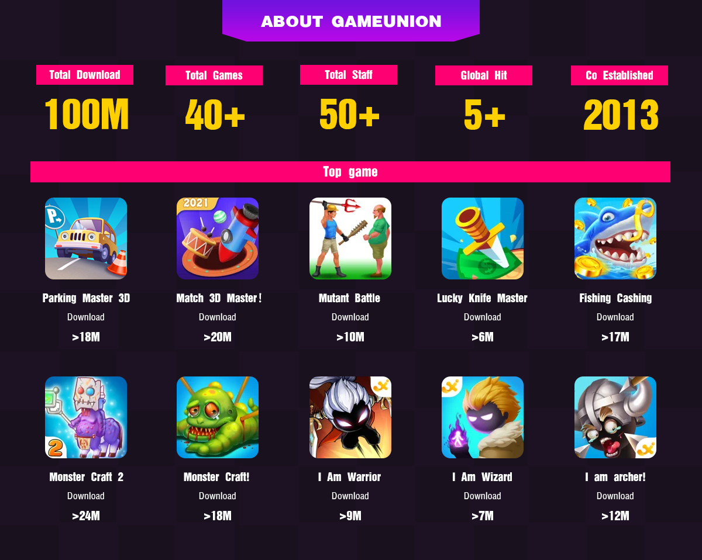
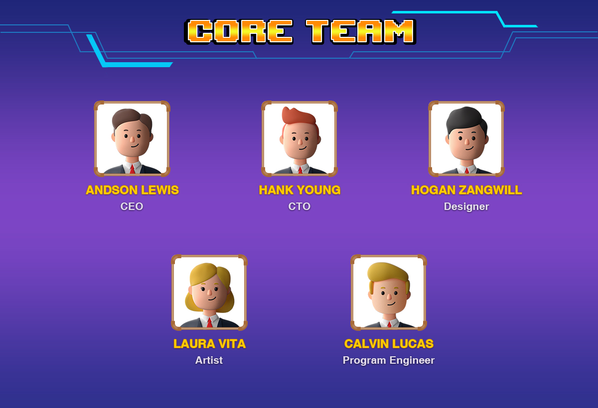

#  Team
#### GameUnion is an indie game developer founded in 2007 focusing on building casual mobile games for over a decade and has recently transitioned into Blockchain Gaming.
----------
GameUnion are a casual game development studio founded in 2013 with the goal of creating the most popular indie game products. With the rise of web3.0, we transform to the blockchain field from 2021, making blockchain games.

Through the polishing of independent games in the mobile Internet field in the past 10 years, we have accumulated several independent games with over 1 million downloads, and we are confident to become a successful blockchain game company. Currently GameUnion consists of 30 engineers and is headquartered in Hong Kong. Our founder team consists of the following members:

