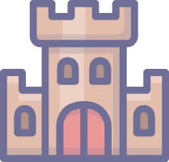

#  Alliance of Doomsday(AOD) Official
#### Official AOD (Alliance of Doomsday) White Paper, last updated Friday, May 15, 2022
##  Introduction
Alliance of Doomsday (Referred as AOD) is the first game launched on the GameUnion platform. The core gameplay of this product is strategic warfare. Players manage their own bases, train troops, create personalized heroes, and seek their own way of survival in troubled times.

The product uses blockchain technology to make it run in an open working environment to ensure fairness among players and the value and security of digital assets.

At the same time, the product also introduces the concept of DAO to give players the right of community autonomy. You are not only the player, but also the owner of the game.

The AOD is a SLG game experiences to NFT collectibles on the blockchain by GameUnion. 

