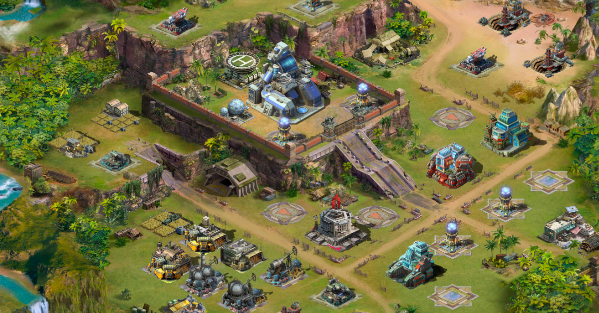
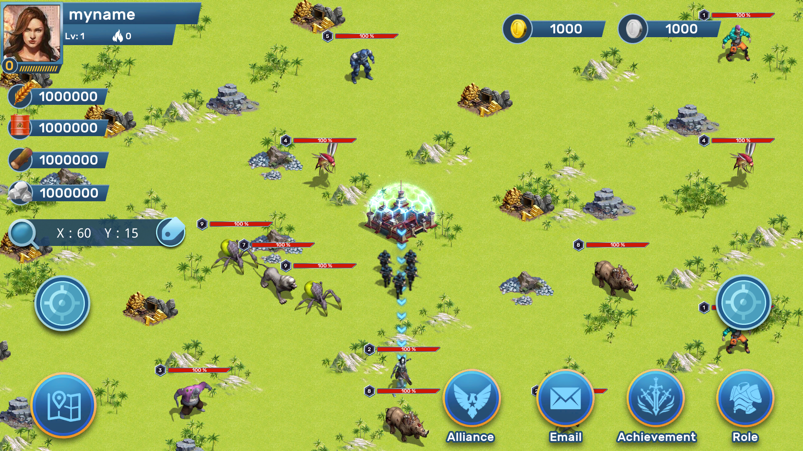

#   The AOD World
#### GameUnion: The story of AOD
Breakthroughs in biotechnology have not only eliminated many diseases and made significant contributions to the progress of human civilization, but also buried huge hidden dangers. An accidental leak in a laboratory spreads a biological virus to the outside world. It starts with a region, then a city, then a country, and then the whole world. Viruses turn living beings into biological weapons that have no consciousness and thoughts and can only kill. Human existence is facing unprecedented challenges, and many people have been killed. The surviving people united, they established bases, supported each other, jointly resisted the attacks of biochemical monsters, and sought a way out for the survival and future of mankind.

Here, you will play as a commander and have your own base. You will build and fight alongside the inhabitants of the land, by gathering resources, clearing monsters around, fortifying defenses, building communities, and recruiting survivors to run the base and make it prosperous. Please protect the people here and work to save the world.

