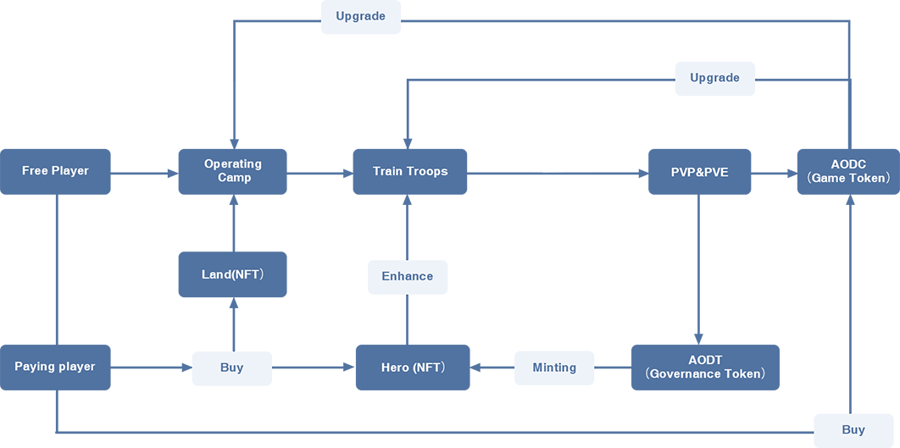

# 经济模型流转图

* AODT作为Surviverse元宇宙的治理代币，基于BEP 20协议发行，总量4千万枚。，是Surviverse整个生态的价值衡量，同时是用户在DAO中的投票权重。是游戏一般等价物，价值载体。获得方式有排行榜奖励、游戏战争赔款。 
* AODC是Alliance of Doomsday的激励代币，获取方法有任务奖励、PVE掉落、PVP战斗掠夺、游戏宝箱掉落、排行榜奖励等方式。可以用AODC在游戏当中升级英雄、建筑等，也可以用于游戏中购买道具。 
* 土地、英雄是基于ERC-721发行的NFT。作为游戏中的主要元素，土地、英雄可以利用游戏资源升级，资源可以生产及消耗。 

